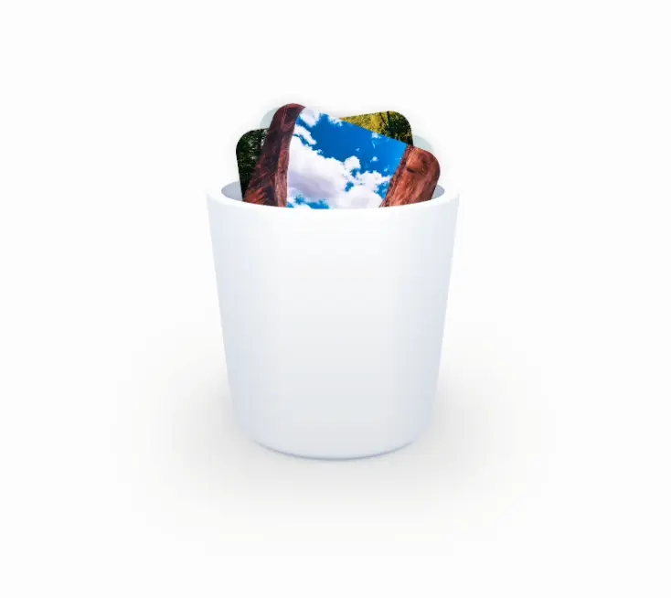

# Personal Site


Welcome to my personal site! This project showcases various interactive and visually appealing web components and pages. Below you'll find a brief overview of the different sections and features included in this site.

You can view the live site at [Gibson Murray](https://gibsonmurray.com).

## Features

### Landing Page Hero

A visually striking landing page hero section with engaging animations and design.

-   **Link:** [/landing-page-hero](./app/(pages)/landing-page-hero/page.tsx)
-   **Thumbnail:** 

### Apple Watch Gestures

A demonstration of Apple Watch gestures with smooth animations.

-   **Link:** [/apple-watch-gestures](./app/(pages)/apple-watch-gestures/page.tsx)
-   **Thumbnail:** 

### Parallax Seasons

An interactive parallax effect showcasing different seasons.

-   **Link:** [/parallax-seasons](./app/(pages)/parallax-seasons/page.tsx)
-   **Thumbnail:** 

### Parallax Devices

A parallax effect featuring various devices.

-   **Link:** [/parallax-devices](./app/(pages)/parallax-devices/page.tsx)
-   **Thumbnail:** 

### Sticky Notes

A fun and interactive sticky notes section.

-   **Link:** [/sticky-notes](./app/(pages)/sticky-notes/page.tsx)
-   **Thumbnail:** 

### About Me

A personal introduction and background.

-   **Link:** [/about](./app/(pages)/about/page.tsx)
-   **Thumbnail:** 

### Dune Thumper

An engaging section inspired by the Dune universe.

-   **Link:** [/dune-thumper](./app/(pages)/dune-thumper/page.tsx)
-   **Thumbnail:** 

### Trashy Photos

A gallery of "trashy" photos with a unique aesthetic.

-   **Link:** [/trashy-photos](./app/(pages)/trashy-photos/page.tsx)
-   **Thumbnail:** 

### Jumpy Cards

Interactive cards with a jumpy animation effect.

-   **Link:** [/jumpy-cards](./app/(pages)/jumpy-cards/page.tsx)
-   **Thumbnail:** 

### Magic Terminal

A terminal-inspired interactive section.

-   **Link:** [/magic-terminal](./app/(pages)/magic-terminal/page.tsx)
-   **Thumbnail:** 

### iPhone Widget Flood

A flood of iPhone widgets with a sleek design.

-   **Link:** [/iphone-widget-flood](./app/(pages)/iphone-widget-flood/page.tsx)
-   **Thumbnail:** 

## Technologies Used

-   **Next.js:** Framework
-   **React:** Library
-   **Tailwind CSS:** Styling and layout
-   **GSAP:** Complex animations
-   **Framer Motion** Interactive animations
-   **TypeScript:** Type-safe JavaScript
-   **3D Plugin:** Additional transform tailwind classes

## Setup

To run this project locally, follow these steps:

1. Clone the repository:

    ```bash
    git clone https://github.com/your-username/personal-site.git
    ```

2. Navigate to the project directory:

    ```bash
    cd personal-site
    ```

3. Install the dependencies:

    ```bash
    npm install
    ```

4. Start the development server:

    ```bash
    npm run dev
    ```

5. Open the site in your browser:
    ```
    http://localhost:3000
    ```

## License

This project is licensed under the MIT License. See the [LICENSE](./LICENSE) file for more information.

Thank you for visiting my personal site! Feel free to explore and reach out if you have any questions or feedback. 😊
